<div align="center">

# ☕ CaffioLens
### AI-Powered Coffee Pack Identifier


**ITE120 Final Project • CSUCC**

[Features](#-features) • [Screenshots](#-screenshots) • [Tech Stack](#%EF%B8%8F-tech-stack) • [Installation](#-installation)

</div>

<br>

## 📖 About

CaffioLens is an intelligent mobile application that uses **TensorFlow Lite AI** to identify coffee packs through your smartphone camera. Built with **Flutter** for seamless cross-platform performance and integrated with **Firebase** for real-time cloud synchronization.

> 🎯 **98%+ accuracy** in coffee pack classification  
> ⚡ **Under 2 seconds** processing time  
> ☁️ **Cloud-synced** scan history

<br>

## 📦 Project Resources

<table>
<tr>
<td align="center" width="50%">

### 💻 Full Project Code
[](https://github.com/carlo1monoy/Full_project_code)

Complete Flutter source code including all Dart files, screens, and configurations.

**[View Repository →](https://github.com/carlo1monoy/Full_project_code)**

</td>
<td align="center" width="50%">

### 🎨 Assets & Resources
[](https://github.com/carlo1monoy/Monoy_InstantCoffee_Classification_FinalProject)

TensorFlow Lite model, screenshots, training data, and all project assets.

**[View Repository →](https://github.com/carlo1monoy/Monoy_InstantCoffee_Classification_FinalProject)**

</td>
</tr>
</table>

<br>

## ✨ Features

<table>
<tr>
<td width="50%">

### 📸 Real-Time Scanning
Instant coffee pack identification using your device camera with live preview and automatic focus.

### 🤖 AI Classification  
TensorFlow Lite model processes images on-device for fast, private coffee type recognition.

### 🖼️ Gallery Support
Select and analyze coffee pack images from your photo library with same AI accuracy.

</td>
<td width="50%">

### 📊 Smart Dashboard
Track total scans, success rates, and daily activity with real-time statistics.

### 📜 Scan History
Browse complete history with thumbnails, timestamps, and confidence scores.

### ☁️ Cloud Sync
Automatic Firebase backup ensures your data is safe and accessible anywhere.

</td>
</tr>
</table>

<br>

## 📸 Screenshots

<div align="center">

| 🏠 Home | 📷 Scanner | 🖼️ Gallery | ✅ Results | 🎯 Predictions | 📜 History |
|:---:|:---:|:---:|:---:|:---:|:---:|
|  |  |  |  |  |  |
| Real-time stats & activity | Live preview & instant capture | Pick from device library | AI accuracy & graph | Probability ranking | Cloud-synced scan log |

</div>

### 📱 Screen Details

<details>
<summary><b>🏠 Home Dashboard</b></summary>

<br>


**Key Functions:**
- 📊 Real-time statistics (Total Scans, Success Rate, Today's Count)
- 📜 Recent scans list with thumbnails and confidence scores
- ⚡ Live Firebase updates
- 🧭 Quick navigation to all app sections

</details>

<details>
<summary><b>📷 Camera Scanner</b></summary>

<br>


**Key Functions:**
- 📸 Live camera viewfinder with auto-focus
- 🎯 One-tap capture button
- 🔄 Instant processing for identified items
- 🧭 Persistent bottom navigation

</details>

<details>
<summary><b>🖼️ Gallery Selection</b></summary>

<br>


**Key Functions:**
- 📁 Access device photo library
- 🔍 Analyze previously captured coffee packs
- 🤖 High-accuracy recognition of saved images
- ⚡ Quick processing of stationary samples

</details>

<details>
<summary><b>✅ Scan Results & Predictions</b></summary>

<br>

<table>
<tr>
<td align="center"><br><b>Probability Graph</b></td>
<td align="center"><br><b>Detailed Predictions</b></td>
</tr>
</table>

**and this is connected to the scan example and graph**

**Key Functions:**
- 📊 **Probability Visualization** - Interactive graph showing identification results
- 🎯 **All Predictions List** - Complete breakdown of AI scores for all categories
- 📈 Confidence score percentage (0-100%)
- 💾 Automatic save to Firebase
- 🔄 Quick "Scan Again" action

</details>

<details>
<summary><b>📜 Scan History</b></summary>

<br>


**Key Functions:**
- 📋 Complete log of all scans
- 🖼️ Thumbnail previews
- 📊 Color-coded confidence badges (Green = Success, Orange = Low confidence)
- 🕒 Date and time stamps
- ☁️ Real-time Firebase synchronization

</details>

<br>

## 🛠️ Tech Stack

```
Frontend        Flutter 3.0+ • Dart 3.0+ • Material Design
AI/ML          TensorFlow Lite 0.12.0 • On-device inference
Backend        Firebase Firestore • Firebase Core
Camera         Camera Plugin 0.10.5+ • Image Picker 1.1.2
Analytics      FL Chart 0.68.0 • Real-time statistics
Design         Google Fonts (Lato) • Coffee-themed palette
```

<details>
<summary><b>📦 View All Dependencies</b></summary>

```yaml
dependencies:
  flutter: sdk
  camera: ^0.10.5+9
  tflite_flutter: ^0.12.0
  firebase_core: ^2.31.0
  cloud_firestore: ^4.17.3
  image_picker: ^1.1.2
  fl_chart: ^0.68.0
  google_fonts: ^6.2.1
  permission_handler: ^11.3.1
  image: ^4.2.0
  path_provider: ^2.1.1
  intl: ^0.19.0
```

</details>

<br>

## 🚀 Quick Start

```bash
# 1. Clone repository
git clone https://github.com/carlo1monoy/Full_project_code
cd caffiolens

# 2. Install dependencies
flutter pub get

# 3. Run the app
flutter run
```

### Prerequisites
- Flutter SDK 3.0+
- Dart SDK 3.0+
- Android Studio / Xcode
- Firebase account (for cloud features)

<br>

## ⚙️ How It Works

```mermaid
graph LR
    A[📱 Launch App] --> B[📸 Capture/Select Image]
    B --> C[🤖 TFLite Processing]
    C --> D[✅ AI Classification]
    D --> E[📊 Display Results]
    E --> F[☁️ Save to Firebase]
    F --> G[📜 Update History]
```



1. **Capture** - Take photo or select from gallery
2. **Process** - TensorFlow Lite analyzes image features
3. **Classify** - AI identifies coffee pack with confidence score
4. **Save** - Results automatically saved to Firebase
5. **Track** - View statistics and history anytime

<br>

## 💻 Source Code

<details>
<summary><b>📄 main.dart</b> - Main Application</summary>

```dart
// Paste your complete main.dart code here
// Includes: HomeScreen, CameraScreen, ResultsScreen, PredictionsScreen
```

</details>

<details>
<summary><b>🤖 tflite_helper.dart</b> - AI Model Integration</summary>

```dart
// Paste your tflite_helper.dart code here
// TensorFlow Lite model loading and image processing
```

</details>

<details>
<summary><b>🔥 firebase_options.dart</b> - Firebase Config</summary>

```dart
// Paste your firebase_options.dart code here
// Platform-specific Firebase initialization
```

</details>

<br>

## 📊 Project Stats

- **Language:** Dart
- **Framework:** Flutter
- **ML Model:** TensorFlow Lite
- **Accuracy:** 98%+
- **Processing Time:** < 2 seconds
- **Platform Support:** Android, iOS

<br>

## 📄 License

This project is licensed under the **MIT License**.

<br>

## 👨‍💻 Author

<div align="center">

**Anthony Charles Monoy**

📧 anthonycharles.monoy@csucc.edu.ph  
🎓 ITE120 Final Project  
🏫 CSUCC

<br>

---

<sub>Made with ❤️ and ☕ using Flutter</sub>

**⭐ Star this repository if you find it helpful!**

</div>
